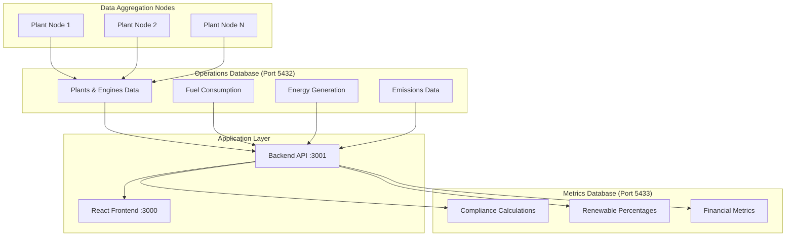
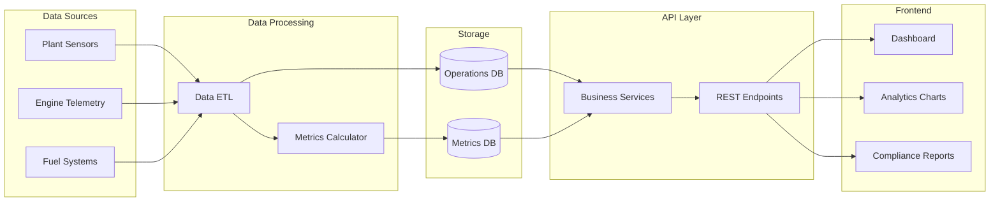

# Wärtsilä Sustainability Intelligence Platform (WISA)

## Project Goals

Companies face significant challenges following environmental compliance regulations while being primarily driven by financial metrics. This platform prioritizes **monetary incentives** by making renewable energy profits visible alongside legislative penalties. By showcasing earned value from sustainable operations, companies can see immediate financial benefits of transitioning to renewable energy sources rather than just avoiding compliance costs.

## Tech Stack

| Component            | Technology                     | Purpose                                                   |
| -------------------- | ------------------------------ | --------------------------------------------------------- |
| **Backend**          | Node.js + Express + TypeScript | RESTful API server                                        |
| **Frontend**         | React 19 + Material-UI         | Interactive dashboard                                     |
| **Operations DB**    | PostgreSQL                     | Plant/engine operational data                             |
| **Metrics DB**       | PostgreSQL                     | Calculated compliance metrics - currently not implemented |
| **Containerization** | Docker + Docker Compose        | Multi-service orchestration                               |

## Setup

### Backend Setup

```bash
cd backend
npm run build
```

### Full System Deployment

```bash
docker-compose up --build
```
##In case of rstart of the database run the follwing commands
```bash
docker-compose down -v --rmi all
docker-compose up --build
```

**Services:**

- Frontend: `http://localhost:3000`
- Backend API: `http://localhost:3001`
- Operations DB: `localhost:5432`
- Metrics DB: `localhost:5433`

## Database Hierarchy



**Main Compliance Metrics:**

- **Renewable Energy Percentage**: % of total energy from renewable fuels
- **Carbon Emissions Tracking**: CO₂ emissions per MWh
- **Financial Impact**: Revenue from renewable vs penalties from emissions
- **EDP Compliance Score**: Environmental compliance rating
- **Fuel Transition Progress**: Migration from fossil to renewable fuels

## Architecture & Data Flow



## API Routes

### Plants Endpoints

- `GET /api/plants` - List all plants
- `GET /api/plants/:id/general` - Plant overview data
- `GET /api/plants/:id/renewable` - Renewable fuel breakdown
- `GET /api/plants/:id/emissions` - Carbon emissions data
- `GET /api/plants/:id/allowances` - Compliance allowances
- `GET /api/plants/:id/energy` - Energy production metrics

### Engines Endpoints

- `GET /api/engines/:id` - Engine details
- `GET /api/engines/:id/emissions` - Engine emission metrics
- `GET /api/engines/:id/efficiency` - Performance efficiency
- `GET /api/engines/:id/daily` - Daily operational data

### Operations

- `GET /api/operations/health` - System health check
- `GET /api/operations/metrics` - Aggregated metrics

**Data Flow Process:**

1. **Plant sensors** → Real-time operational data
2. **ETL pipeline** → Processes raw data into operations DB
3. **Metrics calculator** → Computes compliance scores and financial impact
4. **REST API** → Serves processed data to frontend
5. **Dashboard** → Visualizes renewable energy profits and compliance status
